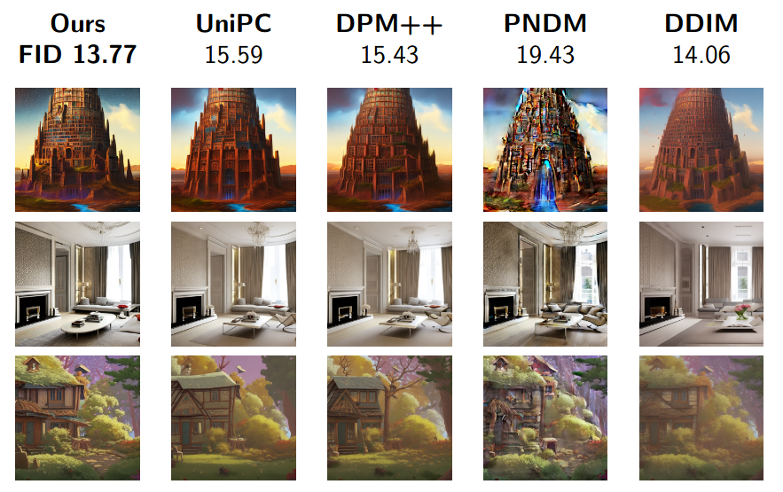

# Gradient estimation sampler
[Frank Permenter](mailto:frank.permenter@tri.global), [Chenyang Yuan](mailto:chenyang.yuan@tri.global)
<a href="https://www.tri.global/" target="_blank">
 
</a>

[**Paper (ICML 2024)**](https://openreview.net/forum?id=o2ND9v0CeK)

This repo contains the code for the gradient estimation sampler introduced in
the paper ["Interpreting and Improving Diffusion Models from an Optimization
Perspective"](https://openreview.net/forum?id=o2ND9v0CeK).

Example outputs on text-to-image Stable Diffusion when limited to N = 10
function evaluations. FID scores for text-to-image generation on MS-COCO 30K.

<p align="center">
  
</p>

## Using the sampler
We provide an implementation of the gradient estimation sampler as `GEScheduler`
in `gescheduler/scheduling_gradient_estimation.py`, which is designed to be
compatible with pipelines from the [huggingface diffusers
library](https://github.com/huggingface/diffusers/). For example, to use this
scheduler in a text-to-image pipeline:

```python
import torch
from diffusers import StableDiffusionPipeline
from gescheduler.scheduling_gradient_estimation import GEScheduler

pipe = StableDiffusionPipeline.from_pretrained('stabilityai/stable-diffusion-2-1-base').to('cuda')
pipe.scheduler = GEScheduler.from_config(pipe.scheduler.config)
prompt = "Cluttered house in the woods, anime, oil painting, high resolution, cottagecore, ghibli inspired, 4k"
img = pipe(prompt, num_inference_steps=10, generator=torch.manual_seed(0)).images[0]
img.save('result.png')
```

## To reproduce experiments in paper
Follow the instructions in [experiments/README.md](/experiments/README.md)

## Acknowledgement
The gradient estimation scheduler uses code adapted from [huggingface diffusers
library](https://github.com/huggingface/diffusers/), whereas the experiment code
is adapted from the [PNDM repository](https://github.com/luping-liu/PNDM).

## Citation
```
@inproceedings{
permenter2024interpreting,
title={Interpreting and Improving Diffusion Models from an Optimization Perspective},
author={Frank Permenter and Chenyang Yuan},
booktitle={Forty-first International Conference on Machine Learning},
year={2024},
url={https://openreview.net/forum?id=o2ND9v0CeK}
}
```
